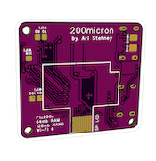
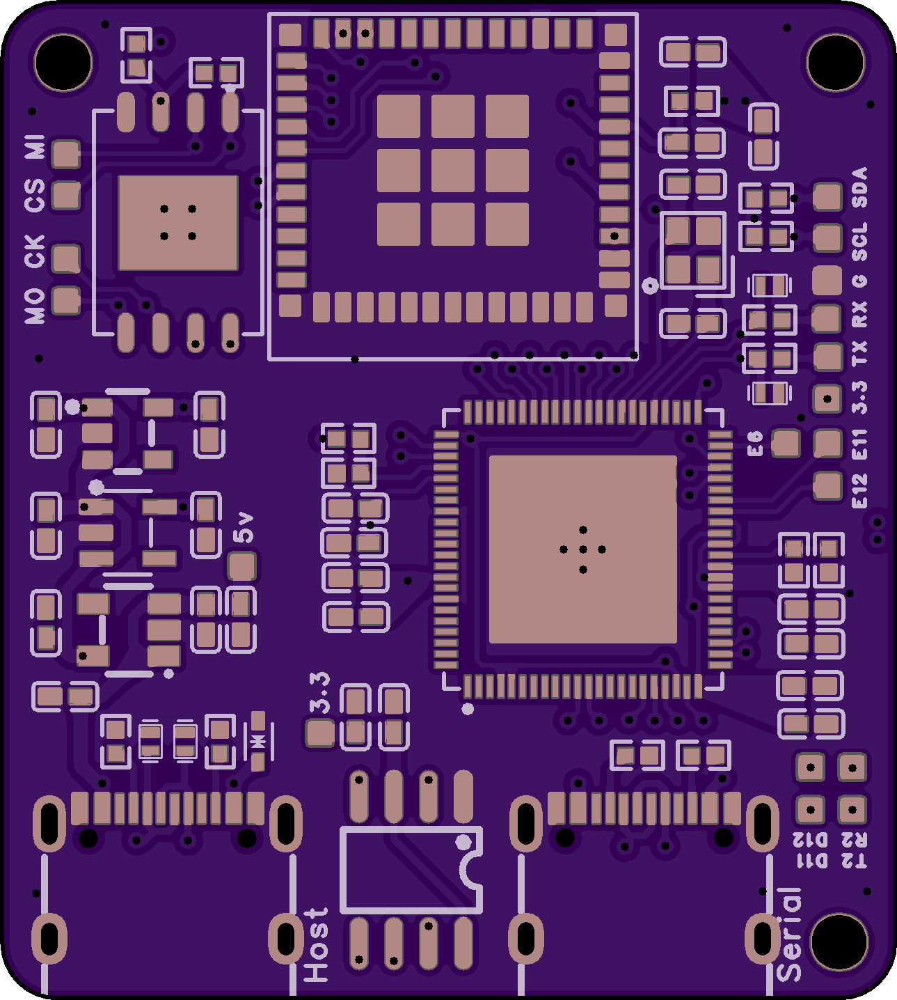
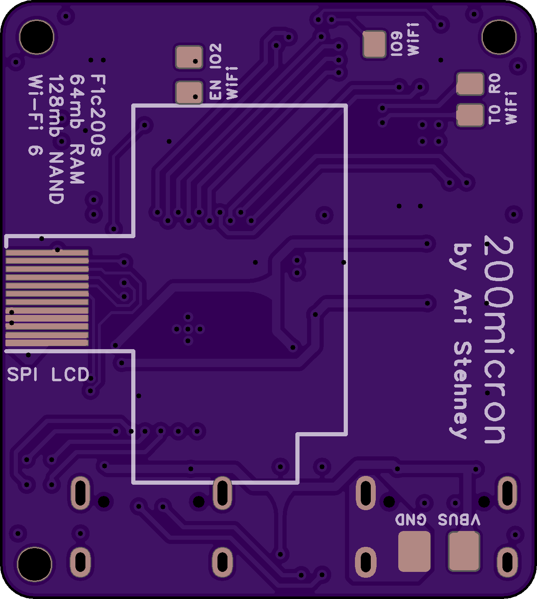

  
  <h1>200micron SBC PCB/CAD</h1>

PCB/CAD for 200micron Linux Single-board computer.

## Manufacturing

This board has been manufactured using the [OSHPark's](https://oshpark.com/) 4 Layer Prototype Service. Three bare PCBs costs roughly $16 USD. You can also order them through JLCPCB which will cost less per board, but more in shipping. Most components (except for CPU and PL2303GL serial bridge) are available through Digikey. (see the included BOM)

  
  

## Assembly

The board is completely single-sided and can be assembled using a small USB-C hotplate and standard soldering equipment. The smallest passive component is 0402, and the CPU and ESP can be soldered by hand with a good bit of time. Ensure you have good quality solder paste and gel flux!

## Case

There is also CAD for a simple case that can be 3D printed out of PETG-CF or something similar that won't warp under heat. It requires the following hardware for each case:
- 3x M2x12mm screws
- 3x M2 nuts
- a small CPU heatsink
